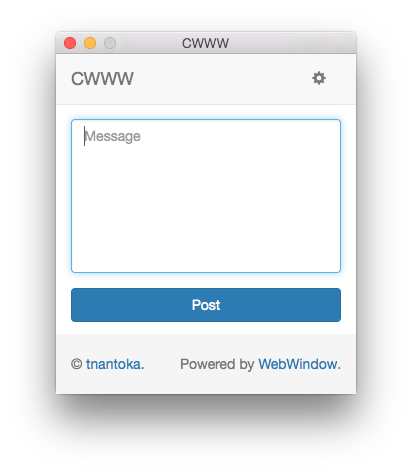

# CWWW

A [ChatWork](https://www.chatwork.com/) client for a single room.



## Requirement

- https://github.com/tnantoka/webwindow
- https://github.com/tnantoka/chatsworth
- https://github.com/jteeuwen/go-bindata
- https://github.com/elazarl/go-bindata-assetfs

## Installation

```
$ go get github.com/tnantoka/cwww
$ cwww
```

## Development

```
$ go-bindata [--debug] data/...
$ go get github.com/tnantoka/cwww
$ cwww
```
